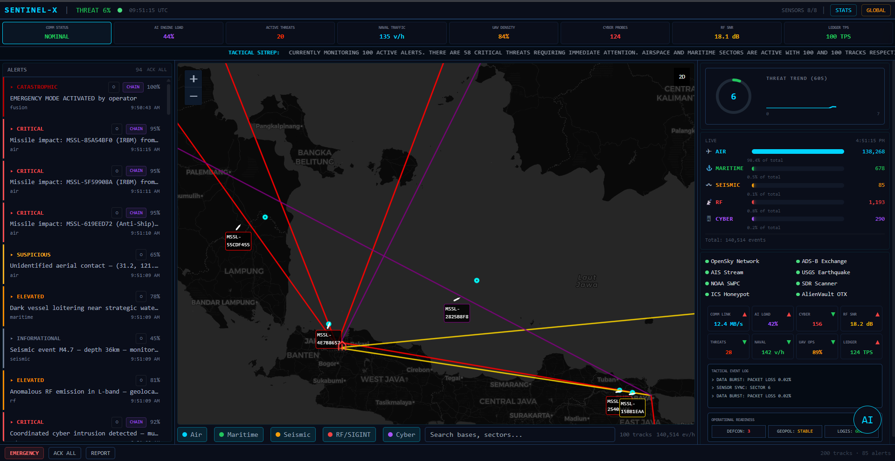
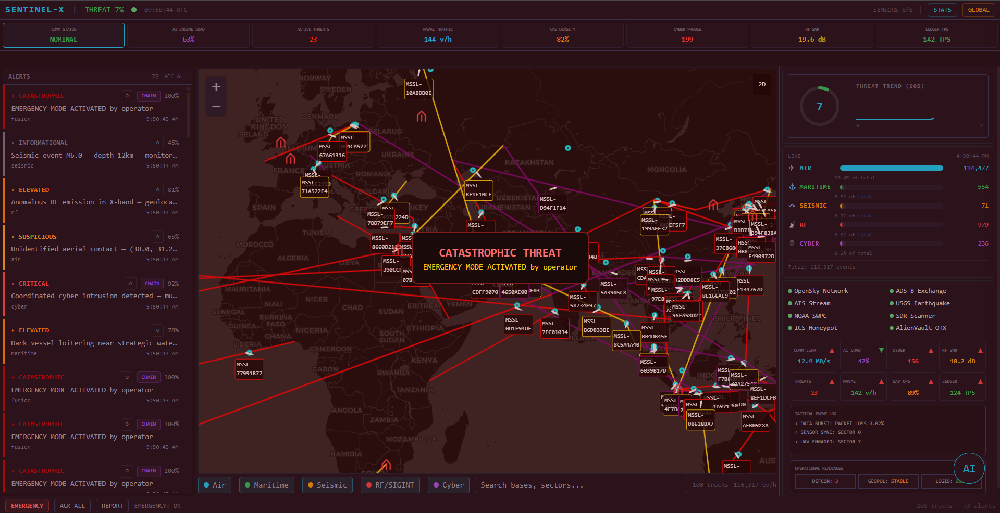
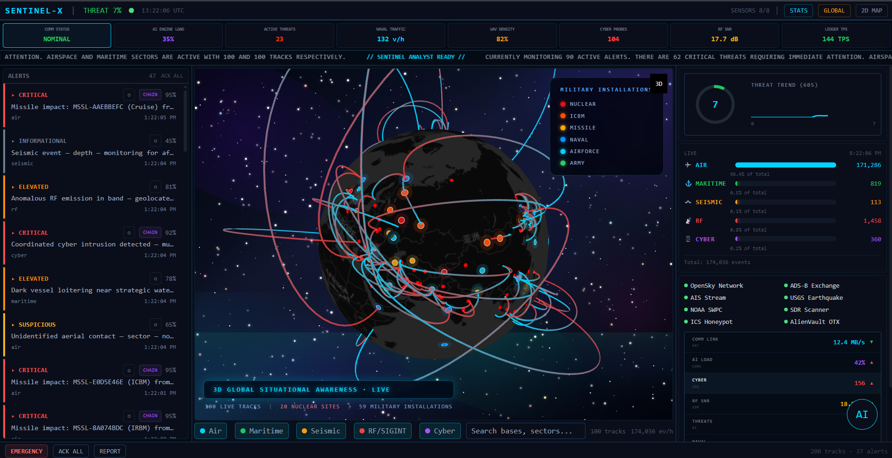
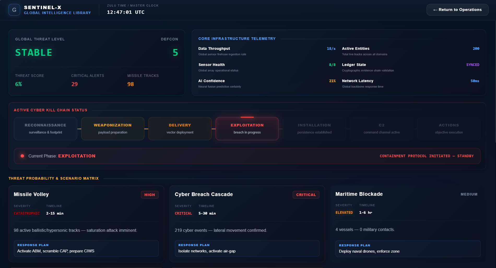
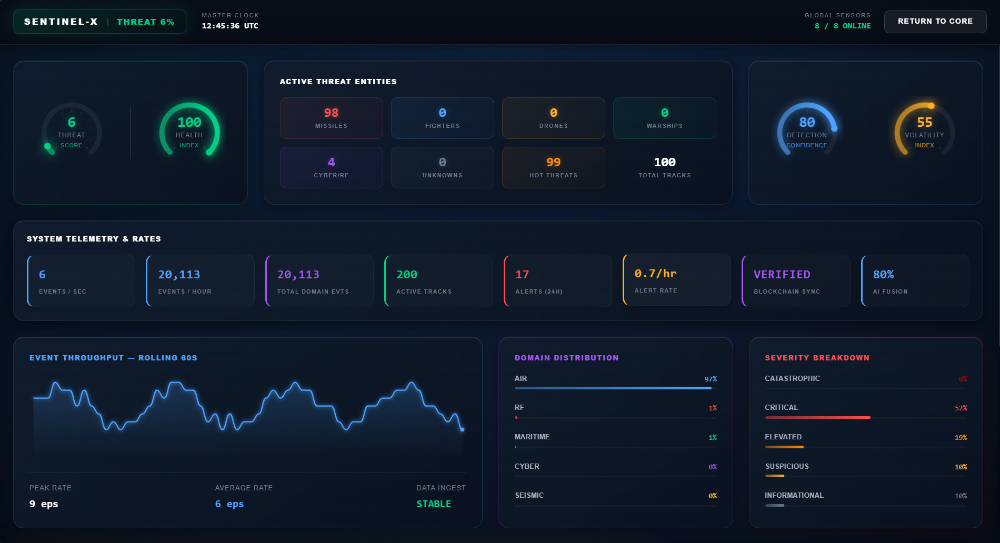
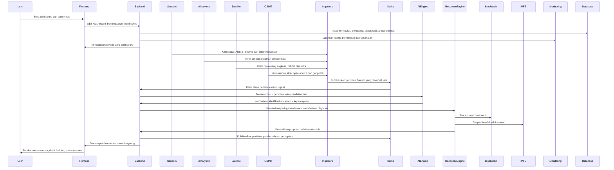
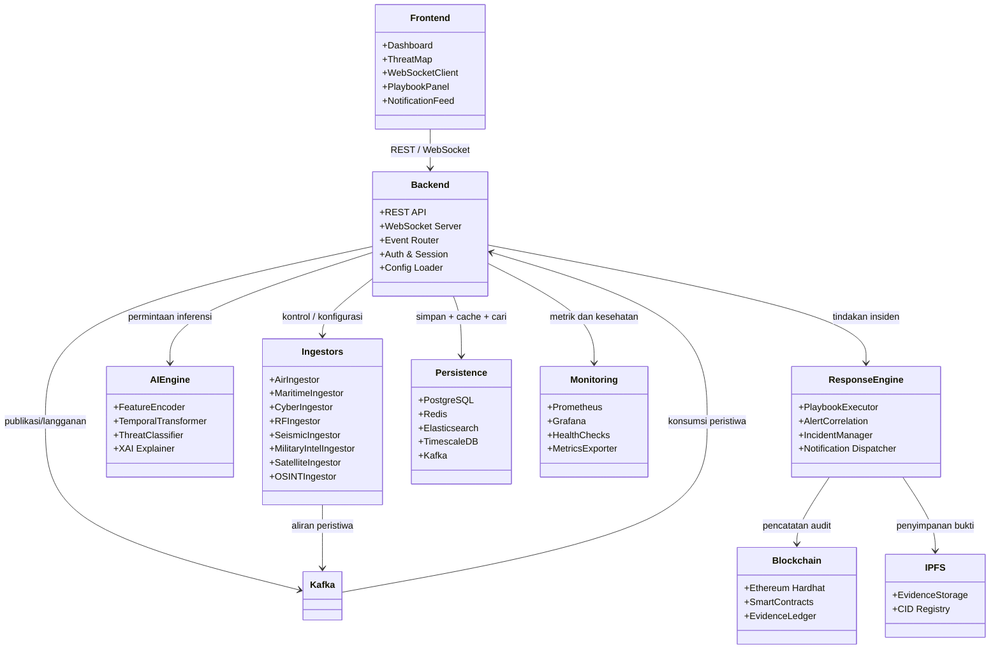
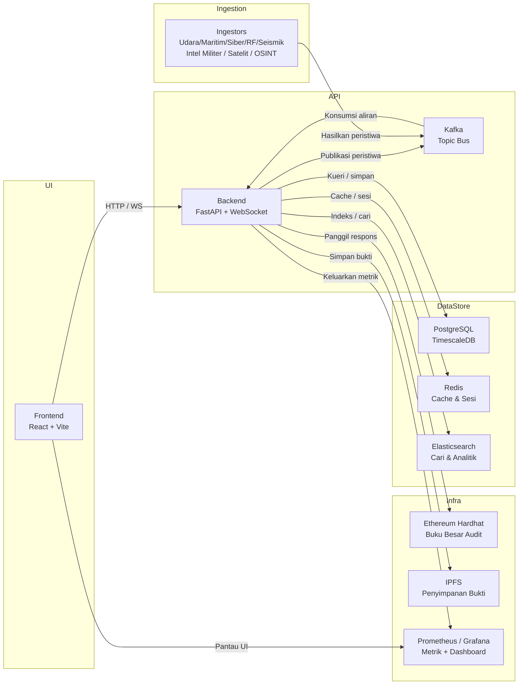

<div align="center">
  
  
  # SENTINEL-X
  **Platform Inteligensi Ancaman & Fusion Multi-Domain - v2.0.0**

  [](LICENSE)
  [](https://github.com/wi5nuu/SENTINEL-X/releases/tag/v2.0.0)
  [](https://reactjs.org/)
  [](https://fastapi.tiangolo.com/)
  [](https://pytorch.org/)
  [](https://ethereum.org/)
  [](https://www.docker.com/)

  > **PENTING: Ini adalah proyek simulasi dan proof-of-concept yang dikembangkan untuk tujuan edukasi, research, dan demonstrasi konsep. Bukan sistem operasional untuk deployment production.**
  
  *Platform demonstrasi untuk kesadaran situasional, korelasi berbasis AI, dan respons insiden otomatis.*
</div>

---

## Tentang Proyek

**SENTINEL-X** adalah **proof-of-concept platform** yang dikembangkan sebagai simulasi dan demonstrasi konsep untuk sistem threat intelligence dan monitoring multi-domain. Proyek ini berawal dari **ide** untuk membuat platform yang bisa mengintegrasikan berbagai sumber data untuk situational awareness.

### Status Proyek:
- **Educational Purpose**: Dibuat untuk pembelajaran dan demonstrasi konsep
- **Research Project**: Eksplorasi teknologi AI, blockchain, dan real-time data processing
- **Proof of Concept**: Demonstrasi bagaimana berbagai teknologi dapat diintegrasikan
- **Not Production-Ready**: Bukan sistem operasional untuk kebutuhan critical infrastructure

### Fitur yang Didemonstrasikan:
- Integrasi multi-domain data sources (aviation, maritime, cyber, space, seismic)
- Real-time data streaming dan event processing
- AI/ML untuk threat correlation dan pattern analysis
- Blockchain untuk audit trail immutability
- Interactive 3D visualization dengan globe view
- Dashboard responsif dengan real-time updates

### Teknologi yang Digunakan:
Platform ini mengeksplorasi penggunaan teknologi modern seperti FastAPI, React, PyTorch, Ethereum, Kafka, dan TimescaleDB dalam satu sistem terintegrasi untuk keperluan demonstrasi dan pembelajaran.

---

## Tur Visual Platform

SENTINEL-X menyediakan serangkaian antarmuka taktis yang disesuaikan untuk berbagai persyaratan operasional. Di bawah ini adalah tampilan mendetail dari tampilan inti platform:

### 1. Dashboard Taktis (Kondisi Normal)
Antarmuka operasional utama dalam kondisi standarnya. Ketika tidak ada ancaman aktif yang terdeteksi, UI tetap tenang, menggunakan estetika siber berwarna biru sejuk. Ini menampilkan telemetri langsung, status sensor aktif, dan log pelacakan normal tanpa membebani operator.
<div align="center">
  
</div>

### 2. Deteksi Ancaman Aktif & Peringatan
Ketika AI Fusion Engine mengonfirmasi ancaman kritis, dashboard secara dinamis mengubah tata letak dan skema warnanya. Antarmuka secara agresif menyoroti anomali (berubah menjadi merah/amber), memicu peringatan modal prioritas tinggi dan memfokuskan perhatian operator sepenuhnya pada insiden aktif dan playbook yang direkomendasikan.
<div align="center">
  
</div>

### 3. Kesadaran Situasional Global 3D Imersif
Didukung oleh `deck.gl`, tampilan ini memberikan representasi 3D globe yang sepenuhnya interaktif. Operator dapat memantau jejak langsung (termasuk lintasan ICBM simulasi dan armada angkatan laut) yang dipetakan terhadap lebih dari 60 instalasi militer dunia nyata. Fitur ini menyertakan latar belakang kanvas ruang angkasa WebGL kustom lengkap dengan aurora, nebula, dan pencahayaan dinamis.
<div align="center">
  
</div>

### 4. Status Inteligensi Global
Dashboard tingkat makro yang didedikasikan untuk umpan inteligensi global. Ini mengagregasi tingkat ancaman siber di seluruh dunia, indikator risiko geopolitik, anomali seismik, dan kesehatan jaringan sensor global ke dalam satu ringkasan terpadu.
<div align="center">
  
</div>

### 5. Analitik & Statistik Tingkat Lanjut
Tampilan analitis mendalam yang menyediakan korelasi data historis, metrik kinerja AI, grafik distribusi ancaman, dan telemetri sistem. Dirancang dengan UI glassmorphic yang bersih, ini menghilangkan elemen yang tidak perlu (seperti emoji) untuk memberikan wawasan yang murni profesional dan padat data.
<div align="center">
  
</div>

---

## Kemampuan Inti

### Ingesti Data Multi-Domain
Mengagregasi dan menormalisasi inteligensi mentah dari 6 domain utama secara mulus melalui antrean pesan Kafka yang sangat dioptimalkan:
- **Pertahanan Udara (ADS-B):** Integrasi OpenSky Network, ADS-B Exchange.
- **Keamanan Maritim (AIS):** Parser NMEA untuk pelacakan kapal gelap (dark vessel).
- **Aktivitas Seismik:** Pemantauan gempa bumi dan bawah tanah USGS.
- **RF/SIGINT:** Analisis sinyal Software-Defined Radio (SDR).
- **Perang Siber:** Honeypot ICS dan umpan ancaman global.
- **Ruang Angkasa & Satelit:** Dataset NASA dan pemantauan orbital.

### AI Threat Fusion Engine
- **Arsitektur Multi-Modal:** Menggunakan 5 encoder khusus domain (Conv1D + Attention) yang masuk ke Temporal Transformer (4 head, 4 layer, 256 timestep).
- **Analitik Prediktif:** Menghasilkan klasifikasi ancaman 5 tingkat, tipe ancaman gabungan multi-label, regresi ETA, dan skor kepercayaan.
- **Explainable AI (XAI):** Menyediakan rantai penalaran berbasis atensi untuk transparansi penuh dalam pengambilan keputusan, memastikan operator mengetahui *mengapa* AI menandai ancaman tersebut.

### Rantai Bukti Blockchain (Audit Zero-Trust)
- **ThreatLedger.sol:** Smart contract yang memastikan pencatatan peristiwa ancaman yang tidak dapat diubah melalui perantaian hash kriptografis.
- **ResponseLog.sol:** Smart contract yang menyediakan jejak audit tahan rusak untuk tindakan operator.
- **Integrasi IPFS:** Penyimpanan terdesentralisasi untuk membundel bukti sensor mentah (file PCAP, sapuan radar) dengan CID IPFS yang aman, memastikan bukti tidak dapat dirusak oleh pihak jahat.

### Respons Insiden Otomatis
- **Matriks Ancaman 5 Tingkat:** Secara otomatis berskala dari *INFORMATIONAL* > *SUSPICIOUS* > *ELEVATED* > *CRITICAL* > *CATASTROPHIC*.
- **YAML Playbook Engine:** Mengeksekusi fase respons otomatis sambil mendukung gerbang persetujuan operator manual untuk tindakan kritis (misalnya, isolasi firewall, otorisasi respons kinetik).

---

## Sumber Data Real-Time

SENTINEL-X mengintegrasikan data real-time dari berbagai sumber publik dan threat intelligence feeds untuk memberikan situational awareness yang komprehensif:

### Data Real-Time yang Terintegrasi:
- **Aviation Domain**: Data penerbangan komersial dan sipil dari sumber data ADS-B publik (OpenSky Network). Dapat ditingkatkan dengan FlightAware AeroAPI untuk detail penerbangan yang lebih akurat termasuk routes, waypoints, delays, dan aircraft type information.
- **Space Weather & Natural Events**: Integrasi dengan NASA untuk pemantauan aktivitas matahari, badai geomagnetik, dan kejadian alam global
- **Cyber Threat Intelligence**: Agregasi dari multiple threat intelligence feeds untuk deteksi ancaman siber real-time
- **Seismic Monitoring**: Data gempa bumi global dari lembaga seismologi internasional (USGS, EMSC)
- **Maritime Domain**: Pelacakan kapal melalui AIS (Automatic Identification System)
- **Weather Correlation**: Integrasi dengan OpenWeatherMap untuk mengkorelasikan kondisi cuaca dengan aviation dan maritime events

### Enhanced Features (Optional):
Platform mendukung fitur-fitur tambahan untuk akurasi data yang lebih tinggi:
- **Enhanced Aviation Data**: FlightAware integration dengan data quality score 0.95
- **Weather Integration**: Real-time weather correlation untuk anomaly detection
- **Multi-Domain Correlation Engine**: Automated cross-domain event correlation dengan ML-based scoring
- **Data Quality Validation**: Comprehensive validation dengan quality scoring 0.0-1.0

Lihat file `ENHANCED_FEATURES.md` untuk detail lengkap tentang fitur-fitur enhanced ini.

Platform ini dirancang untuk beroperasi dengan data real-time dari sumber publik dan API yang sah, dengan fokus pada analisis dan korelasi ancaman untuk keamanan infrastruktur kritis.

---

## Arsitektur Sistem

SENTINEL-X bergantung pada arsitektur microservices berbasis peristiwa yang sangat skalabel:

```text
                    ┌────────────────────────────┐
                    │       React Frontend       │ (Port 3000)
                    │   (Tactical Dashboard)     │
                    └─────────────┬──────────────┘
                                  │ WebSocket
                    ┌─────────────▼──────────────┐
                    │      FastAPI Backend       │ (Port 8000)
                    │ (REST API + WS Broadcast)  │
                    └─────────────┬──────────────┘
                                  │ Kafka
        ┌─────────────────────────┼─────────────────────────┐
        ▼                         ▼                         ▼
┌──────────────┐          ┌──────────────┐          ┌──────────────┐
│  Ingestors   │          │  AI Fusion   │          │   Response   │
│ (Air/Mar/RF/ │          │    Engine    │          │  Coordinator │
│ Seis/Cyber)  │          │ (PyTorch)    │          │  (Playbook)  │
└──────┬───────┘          └──────┬───────┘          └──────┬───────┘
       │                         │                         │
       └─────────────────────────┼─────────────────────────┘
                                 ▼
┌──────────────────────────────────────────────────────────┐
│               Persistensi & Berbagi Data                 │
├──────────────────────────┬──────────────┬────────────────┤
│ PostgreSQL (TimescaleDB) │    Redis     │ Elasticsearch  │
├──────────────────────────┼──────────────┴────────────────┤
│          Kafka           │      Ethereum (Hardhat)       │
├──────────────────────────┴───────────────────────────────┤
│                          IPFS                            │
└──────────────────────────────────────────────────────────┘
```

---

## Arsitektur Aplikasi

SENTINEL-X dibangun dengan arsitektur microservices yang modular dan scalable:

- **Frontend Layer**: Dashboard interaktif berbasis React dengan visualisasi 3D globe
- **API Layer**: Backend FastAPI dengan WebSocket untuk streaming real-time
- **Data Ingestion**: Sistem multi-domain untuk agregasi data dari berbagai sumber
- **AI/ML Engine**: Analisis ancaman berbasis machine learning dengan explainable AI
- **Data Storage**: Database time-series untuk penyimpanan dan analisis historis
- **Event Streaming**: Message queue untuk processing real-time events
- **Blockchain Layer**: Audit trail immutable untuk compliance dan accountability
- **Monitoring**: Real-time metrics dan health checking untuk semua services

---

## Memulai

### Prerequisites

**Minimum System Requirements:**
- CPU: 8 cores (16 recommended)
- RAM: 16GB (32GB recommended)
- Storage: 100GB SSD
- OS: Linux (Ubuntu 22.04 LTS recommended)

**Required Software:**
- Python 3.10+
- Node.js 18+
- Docker 24.0+
- Docker Compose 2.0+

### Quick Start

**Important:** Setup memerlukan konfigurasi ekstensif dan API keys dari berbagai sumber data.

```bash
# Clone repository
git clone <repository-url>
cd sentinel-x

# Setup environment configuration
cp .env.example .env
# Edit .env file dengan 100+ parameter konfigurasi

# Install dependencies
pip install -r requirements.txt

# Build dan start services (20-30 menit)
docker-compose build
docker-compose up -d
```

**Access Points:**
- **Dashboard:** http://localhost
- **API Documentation:** http://localhost:8000/docs
- **Monitoring:** http://localhost/grafana

**Catatan:** Platform memerlukan konfigurasi API keys dari 15+ sumber data eksternal. Lihat `SETUP_REALTIME.md` untuk panduan lengkap.

---

## Keamanan & Compliance

### Fitur Keamanan Built-in:
- API key encryption dan secure storage
- Input sanitization untuk mencegah injection attacks
- Rate limiting pada semua external API calls
- Audit logging untuk semua critical operations
- Role-based access control (RBAC)
- Blockchain-based immutable audit trail

### Best Practices:
- Selalu gunakan HTTPS di production
- Rotate API keys secara berkala
- Monitor audit logs untuk aktivitas mencurigakan
- Keep dependencies updated
- Implement proper firewall rules
- Use strong authentication mechanisms

### Responsible Use:
Platform ini dirancang untuk **legitimate security operations** dan **authorized monitoring** saja. Pengguna bertanggung jawab penuh untuk memastikan penggunaan yang sesuai dengan hukum dan regulasi yang berlaku di wilayah mereka.

---

## Diagram Arsitektur

### Diagram Urutan (Sequence Diagram)



Aliran mendetail tentang bagaimana interaksi pengguna, ingesti peristiwa, fusi ancaman, dan otomatisasi respons bergerak melalui platform.

### Diagram Kelas (Class Diagram)



Tinjauan arsitektur profesional yang memetakan modul inti, dependensi runtime, dan aliran data di seluruh platform Sentinel-X.

### Diagram Deployment



Tinjauan deployment yang menunjukkan bagaimana kontainer layanan dan komponen infrastruktur berinteraksi dalam tumpukan Sentinel-X.

---

## Disclaimer & Legal Notice

### Tentang Proyek Ini:

SENTINEL-X adalah **proyek simulasi dan proof-of-concept** yang dikembangkan untuk:
- **Tujuan Edukasi** - Pembelajaran teknologi dan sistem integration
- **Research & Development** - Eksplorasi konsep threat intelligence platform
- **Portfolio & Demonstrasi** - Showcase kemampuan teknis dan architectural design
- **Proof of Concept** - Demonstrasi feasibility dari ide konseptual

### BUKAN untuk:
- Deployment production atau operational use
- Critical infrastructure protection (belum production-ready)
- Unauthorized surveillance atau monitoring
- Aktivitas illegal atau melanggar hukum

### Status & Keterbatasan:
- Ini adalah **simulasi** dan **demonstrasi konsep**, bukan sistem operasional
- Data yang ditampilkan berasal dari API publik untuk keperluan demonstrasi
- Belum melalui security audit lengkap untuk production deployment
- Tidak ada garansi atau warranty untuk penggunaan apapun

### Tanggung Jawab Pengguna:
Jika Anda memutuskan untuk menggunakan, memodifikasi, atau mendeploy platform ini:
- Pastikan compliance dengan semua hukum dan regulasi yang berlaku
- Gunakan hanya untuk authorized purposes
- Hormati Terms of Service dari semua data providers (OpenSky, NASA, etc.)
- Implement proper security measures jika digunakan
- Conduct security audit sebelum deployment

**Developer tidak bertanggung jawab atas penggunaan atau penyalahgunaan platform ini.**

### Asal Ide:
Proyek ini berawal dari **ide personal** untuk menciptakan platform demonstrasi yang mengintegrasikan berbagai sumber data dan teknologi modern dalam satu sistem. Dikembangkan sebagai learning project dan portfolio showcase.

## Lisensi

Lihat file `LICENSE` untuk informasi lisensi lengkap.

---

<div align="center">
  <br>
  <i>Proyek ini adalah proof-of-concept untuk tujuan edukasi dan demonstrasi.<br>
  Dikembangkan dengan passion untuk teknologi dan security awareness.</i>
  <br><br>
</div>

<div align="center">
  <br>
  <i>Dikembangkan dengan presisi dan mempertimbangkan keamanan.</i>
</div>
