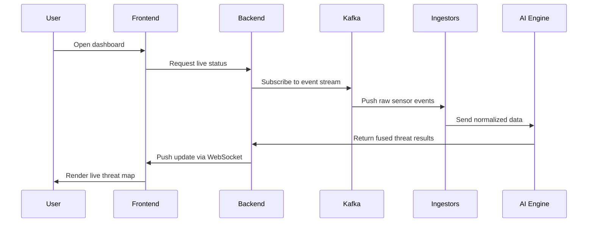
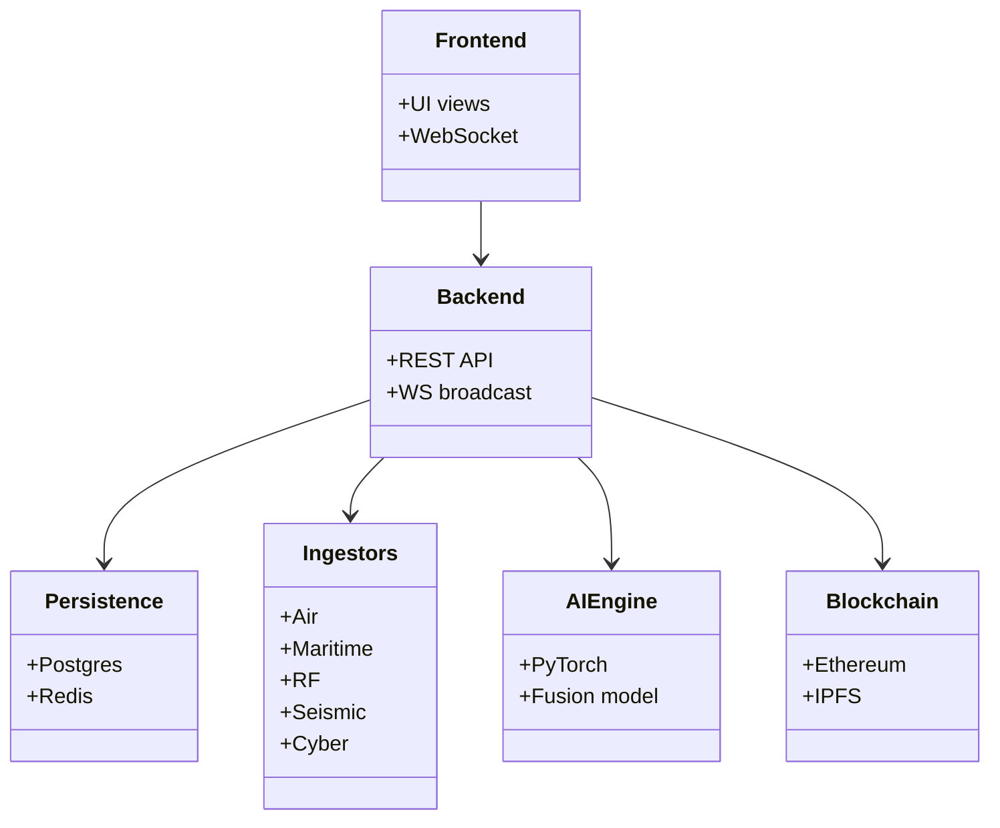

<div align="center">
  
  
  # SENTINEL-X
  **Enterprise Multi-Domain Threat Intelligence & Fusion Platform**

  [](LICENSE)
  [](https://reactjs.org/)
  [](https://fastapi.tiangolo.com/)
  [](https://pytorch.org/)
  [](https://ethereum.org/)
  [](https://www.docker.com/)

  *Advanced Situational Awareness, AI-Powered Correlation, and Automated Incident Response for Security Operations Centers (SOC), Military Command, and Critical Infrastructure Protection.*
</div>

---

## Executive Overview

**SENTINEL-X** is an ultra-low latency, mission-critical threat fusion platform designed to provide a unified, real-time operating picture. By seamlessly integrating raw intelligence from air, maritime, cyber, space, seismic, and RF domains, the platform eliminates the "swivel-chair" problem faced by modern SOC operators. 

Powered by a **PyTorch-based AI Correlation Engine**, SENTINEL-X doesn't just display data—it contextualizes it. It utilizes **Explainable AI (XAI)** to rank threats, calculate ETA regressions, and trigger automated response playbooks. To ensure absolute data integrity and a zero-trust audit trail, all critical events and operator actions are cryptographically hashed and logged directly to an Ethereum-based **Blockchain** and stored securely via **IPFS**.

Capable of processing up to **100,000 events/second** with **<50ms p99 latency**, SENTINEL-X represents the next generation of automated defense infrastructure.

---

## Platform Visual Tour

SENTINEL-X provides a suite of tactical interfaces tailored for different operational requirements. Below is a detailed look at the platform's core views:

### 1. The Tactical Dashboard (Normal State)
The primary operational interface in its standard state. When no active threats are detected, the UI remains calm, utilizing a cool-blue cyber aesthetic. It displays live telemetry, active sensor status, and normal tracking logs without overwhelming the operator.
<div align="center">
  
</div>

### 2. Active Threat Detection & Alerting
When the AI Fusion Engine confirms a critical threat, the dashboard dynamically shifts its layout and color scheme. The interface aggressively highlights the anomaly (shifting to red/amber), triggering high-priority modal alerts and focusing the operator's attention entirely on the active incident and recommended playbooks.
<div align="center">
  
</div>

### 3. Immersive 3D Global Situational Awareness
Powered by `deck.gl`, this view provides a fully interactive 3D representation of the globe. Operators can monitor live tracks (including simulated ICBM trajectories and naval fleets) mapped against over 60 real-world military installations. It features a custom WebGL space canvas background complete with auroras, nebulae, and dynamic lighting.
<div align="center">
  
</div>

### 4. Global Intelligence Status
A macro-level dashboard dedicated to global intelligence feeds. It aggregates worldwide cyber threat levels, geopolitical risk indicators, seismic anomalies, and global sensor network health into a single unified summary.
<div align="center">
  
</div>

### 5. Advanced Analytics & Statistics
A deep-dive analytical view providing historical data correlation, AI performance metrics, threat distribution charts, and system telemetry. Designed with a clean, glassmorphic UI, it strips away unnecessary elements (like emojis) to deliver purely professional, data-dense insights.
<div align="center">
  
</div>

---

## Core Capabilities

### Multi-Domain Data Ingestion
Seamlessly aggregates and normalizes raw intelligence from 6 key domains via highly optimized Kafka message queues:
- **Air Defense (ADS-B):** OpenSky Network, ADS-B Exchange integration.
- **Maritime Security (AIS):** NMEA parser for dark vessel tracking.
- **Seismic Activity:** USGS earthquake and subterranean monitoring.
- **RF/SIGINT:** Software-Defined Radio (SDR) signal analysis.
- **Cyber Warfare:** ICS honeypots and global threat feeds.
- **Space & Satellite:** NASA datasets and orbital monitoring.

### AI Threat Fusion Engine
- **Multi-Modal Architecture:** Utilizes 5 domain-specific encoders (Conv1D + Attention) feeding into a Temporal Transformer (4 heads, 4 layers, 256 timesteps).
- **Predictive Analytics:** Outputs 5-level threat classifications, multi-label compound threat types, ETA regression, and confidence scoring.
- **Explainable AI (XAI):** Provides an attention-based reasoning chain for complete transparency in decision-making, ensuring operators know *why* the AI flagged a threat.

### Blockchain Evidence Chain (Zero-Trust Audit)
- **ThreatLedger.sol:** Smart contract ensuring immutable threat event logging via cryptographic hash chaining.
- **ResponseLog.sol:** Smart contract providing a tamper-proof audit trail for operator actions.
- **IPFS Integration:** Decentralized storage for bundling raw sensor evidence (PCAP files, radar sweeps) with secure IPFS CIDs, ensuring evidence cannot be tampered with by bad actors.

### Automated Incident Response
- **5-Level Threat Matrix:** Automatically scales from *INFORMATIONAL* > *SUSPICIOUS* > *ELEVATED* > *CRITICAL* > *CATASTROPHIC*.
- **YAML Playbook Engine:** Executes automated response phases while supporting manual operator approval gates for critical actions (e.g., firewall isolation, kinetic response authorization).

---

## System Architecture

SENTINEL-X relies on a highly scalable, event-driven microservices architecture:

```text
                    ┌────────────────────────────┐
                    │       React Frontend       │ (Port 3000)
                    │   (Tactical Dashboard)     │
                    └─────────────┬──────────────┘
                                  │ WebSocket
                    ┌─────────────▼──────────────┐
                    │      FastAPI Backend       │ (Port 8000)
                    │ (REST API + WS Broadcast)  │
                    └─────────────┬──────────────┘
                                  │ Kafka
        ┌─────────────────────────┼─────────────────────────┐
        ▼                         ▼                         ▼
┌──────────────┐          ┌──────────────┐          ┌──────────────┐
│  Ingestors   │          │  AI Fusion   │          │   Response   │
│ (Air/Mar/RF/ │          │    Engine    │          │  Coordinator │
│ Seis/Cyber)  │          │ (PyTorch)    │          │  (Playbook)  │
└──────┬───────┘          └──────┬───────┘          └──────┬───────┘
       │                         │                         │
       └─────────────────────────┼─────────────────────────┘
                                 ▼
┌──────────────────────────────────────────────────────────┐
│                      Persistence & Shared                │
├──────────────────────────┬──────────────┬────────────────┤
│ PostgreSQL (TimescaleDB) │    Redis     │ Elasticsearch  │
├──────────────────────────┼──────────────┴────────────────┤
│          Kafka           │      Ethereum (Hardhat)       │
├──────────────────────────┴───────────────────────────────┤
│                          IPFS                            │
└──────────────────────────────────────────────────────────┘
```

---

## Project Structure

- **`src/`** — Core source code
  - **`api/`**: FastAPI backend server (WebSockets, REST endpoints).
  - **`frontend/`**: React-based UI (Vite, TypeScript, Deck.gl, Leaflet).
  - **`ai_engine/`**: PyTorch ML models and inference pipelines.
  - **`ingestors/`**: Data ingestion modules for external API polling and socket parsing.
  - **`blockchain/`**: Ethereum smart contracts (`.sol`) and Web3/IPFS integration scripts.
  - **`response/`**: Playbook automation scripts.
- **`config/`** — Centralized `.env` and YAML configurations.
- **`docker/`** — Dockerfiles and entrypoint configurations.
- **`deploy/`** — Infrastructure as Code (Ansible/Terraform).
- **`tests/`** — Pytest suites for CI/CD pipelines.
- **`public/`** — Static assets and documentation imagery.

---

## Getting Started

### Prerequisites
- **Docker & Docker Compose** (Minimum v2.0+)
- **Node.js** (v18+ for local frontend development)
- **Python** (3.10+ for local backend development)
- Minimum System RAM: 16GB (due to AI models and Elasticsearch)

### Deployment via Docker (Recommended)
Launch the entire microservices stack (Frontend, API, Kafka, Zookeeper, Postgres, Redis, IPFS, Hardhat) with a single command:

```bash
# Clone the repository
git clone https://github.com/yourusername/sentinel-x.git
cd sentinel-x

# Build and deploy all containers in detached mode
docker compose up -d --build
```

**Access Points:**
- **Tactical Dashboard:** [http://localhost:3000](http://localhost:3000)
- **FastAPI Swagger Docs:** [http://localhost:8000/docs](http://localhost:8000/docs)
- **Prometheus/Grafana (if enabled):** [http://localhost:3001](http://localhost:3001)

---

## Security & Contribution

- **Security Audits:** Please report any potential vulnerabilities to the security email listed in `SECURITY.md`. Do not open public issues for zero-days.
- **Contributing:** We welcome PRs for new Ingestor domains or Playbook configurations. Please review `CONTRIBUTING.md` before submitting.

---

## Architecture Diagrams

### Sequence Diagram



A high-level operational flow showing how user interactions propagate through the frontend, backend, event bus, and AI engine.

### Class Diagram



A conceptual class overview that maps the main system components and their primary dependencies.

---

## License & Legal

**SENTINEL-X** is designed for legitimate critical infrastructure defense and national security research. Users take full responsibility for compliance with all applicable local, national, and international laws regarding SIGINT, cyber monitoring, and data privacy.

Released under the **MIT License**. See `LICENSE` for details.

<div align="center">
  <br>
  <i>Developed with precision and security in mind.</i>
</div>
