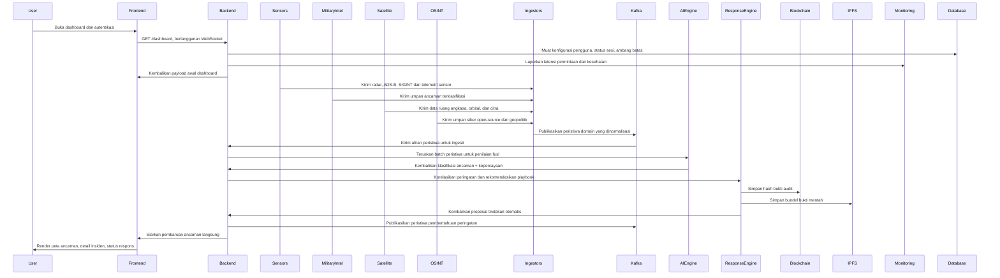
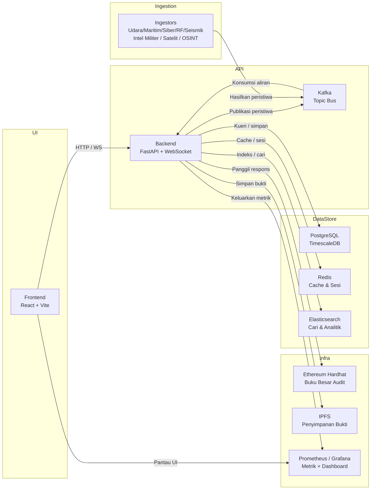

<div align="center">
  
  
  # SENTINEL-X
  **Platform Inteligensi Ancaman & Fusion Multi-Domain Perusahaan**

  [](LICENSE)
  [](https://reactjs.org/)
  [](https://fastapi.tiangolo.com/)
  [](https://pytorch.org/)
  [](https://ethereum.org/)
  [](https://www.docker.com/)

  *Kesadaran Situasional Tingkat Lanjut, Korelasi Berbasis AI, dan Respons Insiden Otomatis untuk Pusat Operasi Keamanan (SOC), Komando Militer, dan Perlindungan Infrastruktur Kritis.*
</div>

---

## Ringkasan Eksekutif

**SENTINEL-X** adalah platform fusi ancaman mission-critical dengan latensi ultra-rendah yang dirancang untuk memberikan gambaran operasional yang terpadu dan real-time. Dengan mengintegrasikan inteligensi mentah secara mulus dari domain udara, maritim, siber, ruang angkasa, seismik, dan RF, platform ini mengeliminasi masalah "swivel-chair" yang dihadapi oleh operator SOC modern.

Didukung oleh **AI Correlation Engine berbasis PyTorch**, SENTINEL-X tidak hanya menampilkan data—tetapi juga mengontekstualisasikannya. Platform ini menggunakan **Explainable AI (XAI)** untuk menentukan peringkat ancaman, menghitung regresi ETA, dan memicu playbook respons otomatis. Untuk memastikan integritas data mutlak dan jejak audit zero-trust, semua peristiwa kritis dan tindakan operator di-hash secara kriptografis dan dicatat langsung ke **Blockchain** berbasis Ethereum dan disimpan secara aman melalui **IPFS**.

Mampu memproses hingga **100.000 peristiwa/detik** dengan **latensi p99 <50ms**, SENTINEL-X mewakili generasi berikutnya dari infrastruktur pertahanan otomatis.

---

## Tur Visual Platform

SENTINEL-X menyediakan serangkaian antarmuka taktis yang disesuaikan untuk berbagai persyaratan operasional. Di bawah ini adalah tampilan mendetail dari tampilan inti platform:

### 1. Dashboard Taktis (Kondisi Normal)
Antarmuka operasional utama dalam kondisi standarnya. Ketika tidak ada ancaman aktif yang terdeteksi, UI tetap tenang, menggunakan estetika siber berwarna biru sejuk. Ini menampilkan telemetri langsung, status sensor aktif, dan log pelacakan normal tanpa membebani operator.
<div align="center">
  
</div>

### 2. Deteksi Ancaman Aktif & Peringatan
Ketika AI Fusion Engine mengonfirmasi ancaman kritis, dashboard secara dinamis mengubah tata letak dan skema warnanya. Antarmuka secara agresif menyoroti anomali (berubah menjadi merah/amber), memicu peringatan modal prioritas tinggi dan memfokuskan perhatian operator sepenuhnya pada insiden aktif dan playbook yang direkomendasikan.
<div align="center">
  
</div>

### 3. Kesadaran Situasional Global 3D Imersif
Didukung oleh `deck.gl`, tampilan ini memberikan representasi 3D globe yang sepenuhnya interaktif. Operator dapat memantau jejak langsung (termasuk lintasan ICBM simulasi dan armada angkatan laut) yang dipetakan terhadap lebih dari 60 instalasi militer dunia nyata. Fitur ini menyertakan latar belakang kanvas ruang angkasa WebGL kustom lengkap dengan aurora, nebula, dan pencahayaan dinamis.
<div align="center">
  
</div>

### 4. Status Inteligensi Global
Dashboard tingkat makro yang didedikasikan untuk umpan inteligensi global. Ini mengagregasi tingkat ancaman siber di seluruh dunia, indikator risiko geopolitik, anomali seismik, dan kesehatan jaringan sensor global ke dalam satu ringkasan terpadu.
<div align="center">
  
</div>

### 5. Analitik & Statistik Tingkat Lanjut
Tampilan analitis mendalam yang menyediakan korelasi data historis, metrik kinerja AI, grafik distribusi ancaman, dan telemetri sistem. Dirancang dengan UI glassmorphic yang bersih, ini menghilangkan elemen yang tidak perlu (seperti emoji) untuk memberikan wawasan yang murni profesional dan padat data.
<div align="center">
  
</div>

---

## Kemampuan Inti

### Ingesti Data Multi-Domain
Mengagregasi dan menormalisasi inteligensi mentah dari 6 domain utama secara mulus melalui antrean pesan Kafka yang sangat dioptimalkan:
- **Pertahanan Udara (ADS-B):** Integrasi OpenSky Network, ADS-B Exchange.
- **Keamanan Maritim (AIS):** Parser NMEA untuk pelacakan kapal gelap (dark vessel).
- **Aktivitas Seismik:** Pemantauan gempa bumi dan bawah tanah USGS.
- **RF/SIGINT:** Analisis sinyal Software-Defined Radio (SDR).
- **Perang Siber:** Honeypot ICS dan umpan ancaman global.
- **Ruang Angkasa & Satelit:** Dataset NASA dan pemantauan orbital.

### AI Threat Fusion Engine
- **Arsitektur Multi-Modal:** Menggunakan 5 encoder khusus domain (Conv1D + Attention) yang masuk ke Temporal Transformer (4 head, 4 layer, 256 timestep).
- **Analitik Prediktif:** Menghasilkan klasifikasi ancaman 5 tingkat, tipe ancaman gabungan multi-label, regresi ETA, dan skor kepercayaan.
- **Explainable AI (XAI):** Menyediakan rantai penalaran berbasis atensi untuk transparansi penuh dalam pengambilan keputusan, memastikan operator mengetahui *mengapa* AI menandai ancaman tersebut.

### Rantai Bukti Blockchain (Audit Zero-Trust)
- **ThreatLedger.sol:** Smart contract yang memastikan pencatatan peristiwa ancaman yang tidak dapat diubah melalui perantaian hash kriptografis.
- **ResponseLog.sol:** Smart contract yang menyediakan jejak audit tahan rusak untuk tindakan operator.
- **Integrasi IPFS:** Penyimpanan terdesentralisasi untuk membundel bukti sensor mentah (file PCAP, sapuan radar) dengan CID IPFS yang aman, memastikan bukti tidak dapat dirusak oleh pihak jahat.

### Respons Insiden Otomatis
- **Matriks Ancaman 5 Tingkat:** Secara otomatis berskala dari *INFORMATIONAL* > *SUSPICIOUS* > *ELEVATED* > *CRITICAL* > *CATASTROPHIC*.
- **YAML Playbook Engine:** Mengeksekusi fase respons otomatis sambil mendukung gerbang persetujuan operator manual untuk tindakan kritis (misalnya, isolasi firewall, otorisasi respons kinetik).

---

## Sumber Data & Simulasi

SENTINEL-X beroperasi dengan pendekatan hibrida (hybrid), menggabungkan simulasi taktis tingkat tinggi dengan integrasi data dunia nyata:

### 1. Data Simulasi & Sintetis (Dummy)
Proyek ini memiliki modul khusus bernama **SyntheticGenerator** (di `src/synthetic_generator/generator.py`). Modul ini berfungsi untuk membuat data buatan yang realistis untuk tujuan demo, pengujian, dan pelatihan model AI tanpa harus bergantung pada koneksi internet atau API berbayar.
- **Target Strategis**: Data simulasi ini menggunakan koordinat nyata dari pangkalan militer dunia, kota-kota besar (termasuk Jakarta, Manila, dll), dan jalur maritim internasional.
- **Skenario**: Modul ini mensimulasikan pergerakan pesawat (air tracks), posisi kapal (maritime positions), serangan cyber, anomali sinyal RF, hingga jalur peluncuran rudal (missile tracks) yang dihitung secara matematis berdasarkan kecepatan Mach dan lintasan Great Circle.

### 2. Data Real-World (Integrasi API Nyata)
Selain data simulasi, Sentinel dirancang untuk terhubung ke sumber data dunia nyata melalui modul-modul Ingestor:
- **Air Domain**: Terintegrasi dengan **OpenSky Network API** (di `src/ingestors/air/ingestor.py`) untuk mengambil data penerbangan asli di seluruh dunia secara real-time.
- **Space & Natural Events**: Terintegrasi dengan **NASA API** (di `src/ingestors/nasa/ingestor.py`) untuk mengambil data asli mengenai:
  - **EONET**: Kejadian alam nyata (kebakaran hutan, badai, gunung meletus).
  - **DONKI**: Data cuaca luar angkasa nyata (Solar Flares/Badai Matahari, Geomagnetic Storms) yang berdampak pada sinyal GPS dan RF di bumi.
- **Cyber Domain**: Siap terhubung ke *threat intelligence feeds* seperti **OTX (AlienVault)**, **Shodan**, dan **AbuseIPDB** untuk mendeteksi IP berbahaya yang benar-benar ada di internet.

---

## Arsitektur Sistem

SENTINEL-X bergantung pada arsitektur microservices berbasis peristiwa yang sangat skalabel:

```text
                    ┌────────────────────────────┐
                    │       React Frontend       │ (Port 3000)
                    │   (Tactical Dashboard)     │
                    └─────────────┬──────────────┘
                                  │ WebSocket
                    ┌─────────────▼──────────────┐
                    │      FastAPI Backend       │ (Port 8000)
                    │ (REST API + WS Broadcast)  │
                    └─────────────┬──────────────┘
                                  │ Kafka
        ┌─────────────────────────┼─────────────────────────┐
        ▼                         ▼                         ▼
┌──────────────┐          ┌──────────────┐          ┌──────────────┐
│  Ingestors   │          │  AI Fusion   │          │   Response   │
│ (Air/Mar/RF/ │          │    Engine    │          │  Coordinator │
│ Seis/Cyber)  │          │ (PyTorch)    │          │  (Playbook)  │
└──────┬───────┘          └──────┬───────┘          └──────┬───────┘
       │                         │                         │
       └─────────────────────────┼─────────────────────────┘
                                 ▼
┌──────────────────────────────────────────────────────────┐
│               Persistensi & Berbagi Data                 │
├──────────────────────────┬──────────────┬────────────────┤
│ PostgreSQL (TimescaleDB) │    Redis     │ Elasticsearch  │
├──────────────────────────┼──────────────┴────────────────┤
│          Kafka           │      Ethereum (Hardhat)       │
├──────────────────────────┴───────────────────────────────┤
│                          IPFS                            │
└──────────────────────────────────────────────────────────┘
```

---

## Struktur Proyek

- **`src/`** — Kode sumber inti
  - **`api/`**: Server backend FastAPI (WebSocket, REST endpoint).
  - **`frontend/`**: UI berbasis React (Vite, TypeScript, Deck.gl, Leaflet).
  - **`ai_engine/`**: Model ML PyTorch dan pipeline inferensi.
  - **`ingestors/`**: Modul ingesti data untuk polling API eksternal dan parsing socket.
  - **`blockchain/`**: Smart contract Ethereum (`.sol`) dan skrip integrasi Web3/IPFS.
  - **`response/`**: Skrip otomatisasi playbook.
- **`config/`** — Konfigurasi `.env` dan YAML terpusat.
- **`docker/`** — Dockerfile dan konfigurasi entrypoint.
- **`deploy/`** — Infrastructure as Code (Ansible/Terraform).
- **`tests/`** — Suite Pytest untuk pipeline CI/CD.
- **`public/`** — Aset statis dan dokumentasi gambar.

---

## Memulai

### Prasyarat
- **Docker & Docker Compose** (Minimal v2.0+)
- **Node.js** (v18+ untuk pengembangan frontend lokal)
- **Python** (3.10+ untuk pengembangan backend lokal)
- RAM Sistem Minimal: 16GB (karena model AI dan Elasticsearch)

### Deployment melalui Docker (Direkomendasikan)
Luncurkan seluruh tumpukan microservices (Frontend, API, Kafka, Zookeeper, Postgres, Redis, IPFS, Hardhat) dengan satu perintah:

```bash
# Klon repositori
git clone https://github.com/yourusername/sentinel-x.git
cd sentinel-x

# Bangun dan deploy semua kontainer dalam mode detached
docker compose up -d --build
```

**Titik Akses:**
- **Dashboard Taktis:** [http://localhost:3000](http://localhost:3000)
- **Dokumentasi Swagger FastAPI:** [http://localhost:8000/docs](http://localhost:8000/docs)
- **Prometheus/Grafana (jika diaktifkan):** [http://localhost:3001](http://localhost:3001)

---

## Keamanan & Kontribusi

- **Audit Keamanan:** Harap laporkan kerentanan potensial ke email keamanan yang tercantum di `SECURITY.md`. Jangan membuka issue publik untuk zero-day.
- **Kontribusi:** Kami menyambut PR untuk domain Ingestor baru atau konfigurasi Playbook. Harap tinjau `CONTRIBUTING.md` sebelum mengirimkan.

---

## Diagram Arsitektur

### Diagram Urutan (Sequence Diagram)



Aliran mendetail tentang bagaimana interaksi pengguna, ingesti peristiwa, fusi ancaman, dan otomatisasi respons bergerak melalui platform.

### Diagram Kelas (Class Diagram)


Tinjauan arsitektur profesional yang memetakan modul inti, dependensi runtime, dan aliran data di seluruh platform Sentinel-X.

### Diagram Deployment



Tinjauan deployment yang menunjukkan bagaimana kontainer layanan dan komponen infrastruktur berinteraksi dalam tumpukan Sentinel-X.

---

## Lisensi & Hukum

**SENTINEL-X** dirancang untuk pertahanan infrastruktur kritis yang sah dan penelitian keamanan nasional. Pengguna bertanggung jawab penuh atas kepatuhan terhadap semua hukum lokal, nasional, dan internasional yang berlaku mengenai SIGINT, pemantauan siber, dan privasi data.

Dirilis di bawah **Lisensi MIT**. Lihat `LICENSE` untuk detailnya.

<div align="center">
  <br>
  <i>Dikembangkan dengan presisi dan mempertimbangkan keamanan.</i>
</div>
